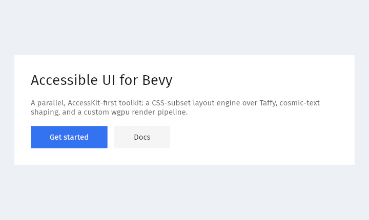

# Buiy

**An accessible, web-quality UI library for the [Bevy](https://bevyengine.org) game engine.**

<p align="center">
  
</p>

Buiy is a comprehensive, AccessKit-first UI toolkit built as a **parallel UI stack to `bevy_ui`** — not on top of it. It wires the same primitives Bevy uses — **Taffy** for layout, **cosmic-text** for shaping and editing, **AccessKit** for the accessibility tree, **bevy_picking** for hit-testing — behind its own decomposed, ECS-native component model and a **custom wgpu render pipeline** that runs inside Bevy's render graph. The north star is modern-web feature parity — CSS layout and styling, complex text with BiDi/IME, ARIA roles, WCAG 2.2 AA — for both game and application UIs, with every machine-testable claim gated in CI.

> **Status — pre-0.1 (`0.0.1`), pre-alpha.** The subsystems below are built and tested, but **APIs are unstable and may break in any commit.** Buiy is not yet tagged or published to crates.io. Some GPU draw paths are verified on a real wgpu adapter behind `#[ignore]` tests, and a handful of CSS sub-features are deferred (called out below). The widget catalog is just two primitives — `Button` and an editable `TextInput` — so Buiy today is a *substrate*, not yet a finished toolkit.

## Highlights

- **A genuine CSS-subset layout engine** over Taffy — flexbox, grid, writing modes, container queries (with multi-level descendant invalidation), anchor positioning, sticky / table / multi-column, transforms + containment, stacking + top layer, `position: fixed`, and `content-visibility`. Far more of the CSS box than `bevy_ui` exposes.
- **A custom wgpu render pipeline** in Bevy's render graph — instance-buffered quads with damage retention, per-node radius clipping, an off-screen effect compositor (opacity / isolation / filters / blend modes / backdrop-filter), a shared LRU glyph/image atlas, and a statically-verified forced-colors (high-contrast) path.
- **First-class text** via cosmic-text — shaping, line layout, BiDi, font fallback, an embedded default font, decorations, and a Taffy measure seam with a steady-state zero-remeasure guarantee.
- **Text editing** — caret and selection model, platform-aware keymap, pointer selection, clipboard, undo/redo with composition-aware grouping, and IME pre-edit composition spliced into the live buffer — surfaced as an editable `TextInput` widget (single/multi-line, placeholder, focus-on-click, submit-on-Enter, caret auto-scroll).
- **Accessibility is foundational, not bolted on** — decomposed `A11yRole` / `A11yLabel` / `A11yDescription` components feed a per-frame AccessKit tree pushed to real per-window adapters, so screen readers see the live UI. Plus a CI a11y-snapshot gate and a WCAG-2 contrast linter.
- **Verification as a deliverable** — a dedicated `buiy_verify` crate, a perceptual-diff golden harness, and an honest CI-vs-GPU gate split.

## Features by subsystem

Everything below is **real and shipping** unless flagged *(partial)* — a sub-feature warns-once and is deferred — or *(GPU-deferred)* — the CPU logic is implemented and tested but the wgpu draw runs only on a real adapter behind an `#[ignore]` test.

### Layout

| Area | What's there |
|---|---|
| Flexbox & Grid | Full axis / wrap / justify / align; grid templates, named areas, auto-flow, auto-tracks |
| Box model | Padding / margin / border edges, `box-sizing`, min/max, aspect-ratio, logical edges |
| Positioning | relative / absolute / `fixed`, inset & logical inset |
| Writing modes | Horizontal & vertical modes, LTR/RTL direction, text-orientation, `unicode-bidi` |
| Container queries | Size queries with active/inactive markers **and** multi-level descendant invalidation, capped at 2× Taffy/frame |
| Anchor positioning | `anchor()` references, `position-try` fallbacks, name registry *(partial: `anchor-size()` & container-unit insets)* |
| Scrolling | Overflow modes, scroll offset, scroll-snap, overscroll-behavior, scrollbar gutter/width/color |
| Transforms & containment | translate/rotate/scale + composed matrix, CSS `contain`, `content-visibility: auto/hidden` |
| Stacking | Stacking contexts, `z-index`, `isolation`, real top layer |
| Tables & multi-column | Positional table layout & greedy column packing *(partial: colspan/rowspan, caption, true fragmentation)* |

Deferred features are centralized in one `LayoutWarnOnceKey` enum (one warning per entity/session), so over-claiming is mechanically visible rather than silent.

### Render

Decomposed, token-driven paint components — `Background`, `Border` (elliptical per-corner radii), `BoxShadow`, `Opacity`, `Outline`, `Filter` / `BackdropFilter`, `MixBlendMode`, `CssVisibility`, `TextColor` — over four WGSL shaders (quad, shadow, glyph coverage, effect composite). Persistent per-frame instance buffers re-upload only what changed; clipping chains ancestor clip rects with radius; the effect compositor unions painted bounds into pow2-bucketed off-screen targets. *(The newer per-view extract and the effect-composite draws are GPU-deferred behind `#[ignore]` adapter tests.)*

### Text & editing

One shared `cosmic_text::FontSystem` drives shaping → `TextBuffer` → `ComputedTextLayout`, with a glyph producer emitting coverage (alpha-as-color) instances through the shared atlas. The full editing substrate — `TextEditState` with `ReadOnly` / `Disabled` / `SingleLine` / `Placeholder` policy markers — sits behind a **sealed facade**: only one module names cosmic's editor types, enforced by a boundary tripwire test, so the engine stays swappable. Editing covers caret/selection, a platform-aware keymap, pointer drag-select, clipboard (plain text), undo/redo (1000-deep, typing-run / IME-aware coalescing), and IME composition with four documented invariants. The `buiy_widgets` `TextInput` widget (`TextInput::single_line` / `multi_line`) wraps all of this with placeholder text, click-to-focus, caret auto-scroll, and submit-on-Enter.

### Accessibility, focus, picking & theme

- **AccessKit producer** — decomposed, `#[non_exhaustive]` a11y components rebuilt each frame into a snapshot-testable tree, pushed to bevy_winit's per-window adapters. *(partial: ~9 roles today; ACCNAME is the literal-string fast path.)*
- **Focus** — ordered Tab / Shift-Tab traversal with `:focus-visible`. *(partial: keyboard-only, no traps / roving-tabindex yet.)*
- **Picking** — AABB hit-testing behind a `bevy_picking` backend feeding a `Hovered` resource.
- **Theme** — `Theme` token maps (color / space / radius), a WCAG-aimed `default_light_theme()`, `UserPreferences` (dark / reduced-motion / forced-colors / …), and a forced-colors theme covering all 16 CSS system colors.

## Quick start

Add Buiy alongside Bevy, then add `BuiyPlugin` **after** `DefaultPlugins`:

```toml
[dependencies]
bevy = "0.18"
buiy = { git = "https://github.com/intendednull/buiy" }
```

```rust
use bevy::prelude::*;
use buiy::*;

fn main() {
    App::new()
        .add_plugins(DefaultPlugins)
        .add_plugins(BuiyPlugin) // composes layout, render, text, a11y, focus, picking, widgets
        .add_systems(Startup, setup)
        .add_systems(Update, on_press)
        .run();
}

fn setup(mut commands: Commands) {
    commands.spawn(Camera2d);

    // A focusable, accessible button (A11yRole::Button + A11yLabel wired for you).
    commands.spawn(Button::new("Save"));

    // An editable single-line text field — caret, selection, clipboard, IME.
    commands.spawn(TextInput::single_line("Search…"));

    // Themed, shaped text through the cosmic-text pipeline.
    commands.spawn((
        Node,
        Style::default(),
        Text("Hello, Buiy!".into()),
        FontSize(24.0),
    ));
}

fn on_press(mut presses: MessageReader<OnPress>) {
    for OnPress(entity) in presses.read() {
        info!("button pressed: {entity:?}");
    }
}
```

`Button::new` returns a ready bundle — marker + `Node` + `Style` + `Background` / `Border` + `Focusable` + `A11yRole::Button` + `A11yLabel` — and emits `OnPress` (a Bevy `Message`) on click. The fluent `Style` builder (`.flex_row()`, `.grid()`, `.width_px()`, `.padding()`, `.absolute()`, …) is the authoring front-end to the decomposed layout components.

## Demos

Two runnable visual demos (plus the headless `capture` tool) live under `examples/`:

```sh
cargo run -p hello_button   # a single clickable "Save" button; logs OnPress to stdout
cargo run -p hello_text     # a themed title above a wrapped body paragraph
```

`hello_text` exercises the full shaping → atlas → coverage-draw path:

<p align="center">
  
</p>

> The screenshots above are produced by Buiy's own render pipeline. Regenerate them headlessly (offscreen render-to-texture + GPU readback, no window needed) with `cargo run -p capture` — see [`examples/capture/`](examples/capture/).

### Requirements

- **Rust:** stable, edition 2024. The MSRV (1.95, the floor bevy 0.19 requires) is declared by `rust-version` in the workspace manifest and enforced by a dedicated CI `msrv` job; `rust-toolchain.toml` pins the floating `stable` channel and the `rustfmt`/`clippy` components.
- **Bevy:** 0.19.
- **Linux system deps** (Bevy needs these to open a window):

  ```sh
  sudo apt-get install -y libasound2-dev libudev-dev libwayland-dev libxkbcommon-dev
  ```

  On macOS / Windows no extra system packages are needed.

## Why a parallel stack?

Buiy deliberately does **not** build on `bevy_ui`. `bevy_ui`'s renderer caps capabilities Buiy treats as table stakes — non-rectangular / radius clipping, off-screen effect-group compositing, `mix-blend-mode`, `isolation`, `backdrop-filter`, a true top layer — so Buiy owns its renderer to reach web parity. The same logic drives the rest of the design:

- **AccessKit-first, decomposed components.** Accessibility ships in the foundation, not a later milestone — small public-fielded `#[non_exhaustive]` components (the lesson of Bevy's `AccessibilityNode` megacomponent, [bevy#17644](https://github.com/bevyengine/bevy/issues/17644)) producing a real per-window AccessKit tree.
- **A swappable text substrate.** The entire cosmic-text dependency is sealed inside `text::edit` behind a tripwire-enforced facade.
- **Forced-colors as a verified path.** Uniform token-only paint lets a build-time analyzer prove every default-catalog paint survives high-contrast with non-shadow state cues.

Buiy and `bevy_ui` can coexist per-window; they are not mixable within one UI tree.

## Project layout

```
crates/
├── buiy/         — public umbrella crate (the one you depend on)
├── buiy_core/    — components, plugins, layout, render, text, a11y, focus, picking, theme
├── buiy_widgets/ — widget implementations (today: Button, TextInput)
└── buiy_verify/  — verification harness: visual goldens, AccessKit snapshots, contrast linter

examples/
├── hello_button/ — minimal clickable button
├── hello_text/   — themed shaped-text scene
└── capture/      — headless screenshot generator for README assets

docs/             — design specs, migration plans, reports, and prior-art (start at docs/README.md)
```

## Building & testing

The "run all checks" command (mirrors CI):

```sh
cargo fmt --all -- --check && \
  cargo clippy --workspace --all-targets -- -D warnings && \
  RUSTDOCFLAGS="-D warnings" cargo doc --workspace --no-deps && \
  xvfb-run -a cargo test --workspace
```

Drop the `xvfb-run -a` prefix on macOS / Windows. GPU golden tests are `#[ignore]`-gated and need a real wgpu adapter — run them with `cargo test -- --ignored`. Before bumping any dependency, run the supply-chain check: `cargo deny check`.

## Documentation

Architecture specs, migration plans, audit reports, and a deep prior-art corpus live under [`docs/`](docs/README.md). Good entry points:

- [`docs/README.md`](docs/README.md) — master index of every spec, plan, report, and prior-art folder.
- [Foundation design](docs/specs/2026-05-07-buiy-foundation/README.md) — the target shape: feature inventory, architecture, and sub-spec roadmap.
- [Layout design](docs/specs/2026-05-08-buiy-layout-design/README.md) · [Render pipeline](docs/specs/2026-06-03-buiy-render-pipeline-design/README.md) · [Text rendering](docs/specs/2026-06-09-buiy-text-rendering-design/README.md).

## License

Dual-licensed under either of [MIT](LICENSE-MIT) or [Apache-2.0](LICENSE-APACHE), at your option.
