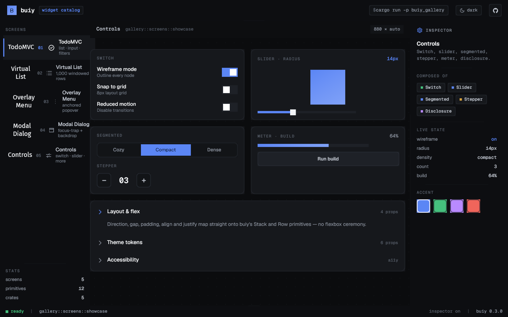
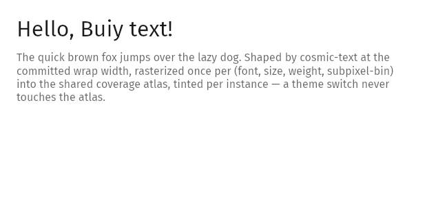

<!-- ┌─────────────────────────────────────────────────────────────────────────┐
     │ AUTHOR DISCLAIMER — DO NOT CHANGE, MOVE, OR REMOVE.                        │
     │ This block is authoritative and must stay verbatim at the top of the      │
     │ README. It applies to ALL future edits, human or automated/LLM. If you    │
     │ are an agent updating this file, preserve this block and its wording        │
     │ exactly; do not paraphrase, soften, or relocate it.                        │
     └─────────────────────────────────────────────────────────────────────────┘ -->
> ⚠️ **This is an experimental project to test out various unsupervised llm workflows. The code is largely unreviewed, and should not be used in production**
<!-- END AUTHOR DISCLAIMER — DO NOT CHANGE -->

# Buiy

**An accessible, web-quality UI library for the [Bevy](https://bevyengine.org) game engine.**

<p align="center">
  
</p>

Buiy is a comprehensive, AccessKit-first UI toolkit built as a **parallel UI stack to `bevy_ui`** — not on top of it. It wires the same primitives Bevy uses — **Taffy** for layout, **cosmic-text** for shaping and editing, **AccessKit** for the accessibility tree, **bevy_picking** for hit-testing — behind its own decomposed, ECS-native component model and a **custom wgpu render pipeline** that runs as a system in Bevy's `Core2d` render schedule (Bevy 0.19 removed the old render-graph node API). The north star is modern-web feature parity — CSS layout and styling, complex text with BiDi/IME, ARIA roles, WCAG 2.2 AA — for both game and application UIs, with every machine-testable claim gated in CI.

> **Status — pre-0.1 (`0.0.1`), pre-alpha.** The subsystems below are built and tested, but **APIs are unstable and may break in any commit.** Buiy is not yet tagged or published to crates.io. Some GPU draw paths are verified on a real wgpu adapter behind `#[ignore]` tests, and a handful of CSS sub-features are deferred (called out below). There is a real widget catalog — Button, an editable TextInput, Checkbox, Switch, Slider, Disclosure, Dialog, Tooltip, Popover, Menu, and ScrollArea — exercised by a runnable widget gallery, but the catalog is still narrower than a mature toolkit and the surface is in flux.

## Highlights

- **A genuine CSS-subset layout engine** over Taffy — flexbox, grid, writing modes, container queries (with multi-level descendant invalidation), anchor positioning, sticky / table / multi-column, transforms + containment, stacking + top layer, `position: fixed`, and `content-visibility`. Far more of the CSS box than `bevy_ui` exposes.
- **A custom wgpu render pipeline** wired into Bevy's `Core2d` render schedule — instance-buffered quads with damage retention and **keyed partial re-extract** (an interactive change re-resolves and re-uploads only the one changed instance, not the whole scene — proven pixel-identical on a real GPU), per-node radius clipping, an off-screen effect compositor (opacity / isolation / filters / blend modes / backdrop-filter), a shared LRU glyph/image atlas, and a statically-verified forced-colors (high-contrast) path.
- **First-class text** via cosmic-text — shaping, line layout, BiDi, font fallback, an embedded default font, decorations, and a Taffy measure seam with a steady-state zero-remeasure guarantee.
- **Text editing** — caret and selection model, platform-aware keymap, pointer selection, clipboard, undo/redo with composition-aware grouping, and IME pre-edit composition spliced into the live buffer — surfaced as an editable `TextInput` widget (single/multi-line, placeholder, focus-on-click, submit-on-Enter, caret auto-scroll).
- **MVU state management in the core** — every stateful widget routes its state changes through one ordered, recordable message funnel (`Model` / `Msg` / pure reducer / `Cmd`), with `enqueue` as the single sanctioned mutation and one drain as the sole writer. A recorded session of real input replays **byte-identically**, including widget-internal state (toggle values, a menu's open index, the editor buffer + caret + selection) that an app-boundary log can't reach.
- **A real widget catalog + a live gallery** — accessible, keyboard-driven Button, TextInput, Checkbox, Switch, Slider, Disclosure, Dialog, Tooltip, Popover, Menu, and ScrollArea (plus composites: progress meter, table rows, search input, kbd chip, status dot), each authorable three ways — a bundle constructor, a `bsn!` scene-fn, or in the unified [widget gallery](examples/buiy_gallery) (five screens: TodoMVC, a 1,000-row virtual list, an overlay menu, a modal dialog, and a controls showcase).
- **Declarative `bsn!` authoring** — the thin `buiy_bsn` crate re-exports Bevy 0.19's `bsn!` / `bsn_list!` scene macros and spawn-ext traits, folded into `buiy::prelude`, so widget trees can be authored declaratively against the same decomposed components.
- **Runs in the browser on WebGPU** — the same custom wgpu pipeline compiles to `wasm32-unknown-unknown` and renders into an HTML `<canvas>`; the full five-screen gallery runs and is mouse-interactive in a WebGPU browser. WebGPU-only for v1 — a WebGL2 fallback, browser screen-reader a11y, IME, and the mobile soft-keyboard are named and deferred, not silently shipped.
- **Accessibility is foundational, not bolted on** — decomposed `A11yRole` / `A11yLabel` / `A11yDescription` components feed a per-frame AccessKit tree pushed to real per-window adapters, so screen readers see the live UI. The same tree is read by an in-process driver that backs both tests and (opt-in) LLM-agent inspection. Plus a CI a11y-snapshot gate and a WCAG-2 contrast linter.
- **Verification as a deliverable** — a dedicated `buiy_verify` crate, a perceptual-diff golden harness, and an honest CI-vs-GPU gate split.

## Features by subsystem

Everything below is **real and shipping** unless flagged *(partial)* — a sub-feature warns-once and is deferred — or *(GPU-deferred)* — the CPU logic is implemented and tested but the wgpu draw runs only on a real adapter behind an `#[ignore]` test.

### Layout

| Area | What's there |
|---|---|
| Flexbox & Grid | Full axis / wrap / justify / align; grid templates, named areas, auto-flow, auto-tracks |
| Box model | Padding / margin / border edges, `box-sizing`, min/max, aspect-ratio, logical edges |
| Positioning | relative / absolute / `fixed`, inset & logical inset |
| Writing modes | Horizontal & vertical modes, LTR/RTL direction, text-orientation, `unicode-bidi` |
| Container queries | Size queries with active/inactive markers **and** multi-level descendant invalidation, capped at 2× Taffy/frame |
| Anchor positioning | `anchor()` references, `position-try` fallbacks, name registry *(partial: `anchor-size()` & container-unit insets)* |
| Scrolling | Overflow modes, scroll offset, scroll-snap, overscroll-behavior, scrollbar gutter/width/color |
| Transforms & containment | translate/rotate/scale + composed matrix, CSS `contain`, `content-visibility: auto/hidden` |
| Stacking | Stacking contexts, `z-index`, `isolation`, real top layer |
| Tables & multi-column | Positional table layout & greedy column packing *(partial: colspan/rowspan, caption, true fragmentation)* |

Deferred features are centralized in one `LayoutWarnOnceKey` enum (one warning per entity/session), so over-claiming is mechanically visible rather than silent.

### Render

Decomposed, token-driven paint components — `Background`, `Border` (elliptical per-corner radii), `BoxShadow`, `Opacity`, `Outline`, `Filter` / `BackdropFilter`, `MixBlendMode`, `CssVisibility`, `TextColor` — over WGSL shaders (quad, shadow, glyph coverage, band/gradient, effect composite). Persistent per-frame instance buffers re-upload only what changed, and a **two-tier Full/Patch keyed partial re-extract** narrows a single interactive value change down to re-resolving and re-uploading exactly one instance; clipping chains ancestor clip rects with radius; the effect compositor unions painted bounds into pow2-bucketed off-screen targets. *(The per-view extract and the effect-composite draws are GPU-deferred behind `#[ignore]` adapter tests.)*

### Text & editing

One shared `cosmic_text::FontSystem` drives shaping → `TextBuffer` → `ComputedTextLayout`, with a glyph producer emitting coverage (alpha-as-color) instances through the shared atlas. The full editing substrate — `TextEditState` with `ReadOnly` / `Disabled` / `SingleLine` / `Placeholder` policy markers — sits behind a **sealed facade**: only one module names cosmic's editor types, enforced by a boundary tripwire test, so the engine stays swappable. Editing covers caret/selection, a platform-aware keymap, pointer drag-select, clipboard (plain text), undo/redo (1000-deep, typing-run / IME-aware coalescing), and IME composition with four documented invariants. The `buiy_widgets` `TextInput` widget (`TextInput::single_line` / `multi_line`) wraps all of this with placeholder text, click-to-focus, caret auto-scroll, and submit-on-Enter.

### State management (MVU)

Buiy ships an Elm-style **Model-View-Update** substrate as the primary state interface in `buiy_core` (`buiy_core::mvu`). An actor declares a `Model` (a `Clone + PartialEq + Reflect` component) and its `Msg`; a pure free-function reducer `fn(&mut M, M::Msg) -> Cmd<M::Msg>` is registered via `MvuAppExt` (`add_model` / `add_reducer`) or the one-call `App::mvu_model`. Handlers only `enqueue` into a per-type inbox; the single ordered drain installed by `MvuCorePlugin` (the `MvuSet::Enqueue → Drain → Bind` chain) is the sole writer and commits via `set_if_neq`, so an idempotent fold never trips `Changed<M>` or cascades a re-extract (asserted by host-independent `MvuWorkCounters`). Reducer purity is enforced at compile time by a sealed `PureEnv` allowlist that excludes `Commands`; effects are values (`Cmd::None` / `Emit` / `Batch`). Three granularity tiers ship: a shared stateful-leaf reducer (one `toggle_reducer` for every checkbox/switch, no per-widget struct), a `Model`+reducer machine (`MenuModel` / `menu_reducer`), and a raw-ECS escape hatch. A record/replay tap plus the editor's command-source log, keyed by a session-stable `LogicalId` and merged under one global sequence, let `buiy_core::replay` re-fold a whole-UI session byte-identically into a fresh, same-seed app; AccessKit/agent actions fold synchronously through the same body, so AT drives become recorded, replayable messages.

`MvuCorePlugin` is wired automatically when you use the widgets (it powers the catalog), and is reachable for your own models via `buiy_core::mvu`. *(partial: opt-in plugin, not folded into `CorePlugin`; today only the toggle leaf, the menu machine, and editor command-sourcing are wired; `Cmd::task` + keyed subscriptions, cross-process logs, Dialog/Popover machines, and `buiy`-prelude surfacing are deferred; replay is scoped to MVU-governed state — structural spawn/despawn is off-log.)*

### Widgets

`buiy_widgets` ships eleven marker-driven, APG-aligned widgets, each with a bundle constructor, a mergeable `bsn!` scene-fn, and accessible keyboard behavior:

| Widget | Constructor | What it is |
|---|---|---|
| Button | `Button::new(label)` | Focusable, accessible button; emits `OnPress` on pointer / keyboard / AT activation |
| TextInput | `TextInput::single_line` / `multi_line` | Editable field — caret, selection, clipboard, undo/redo, IME; submit-on-Enter (single-line) |
| Checkbox | `Checkbox::new(label)` | Tri-state checkbox; Space activates |
| Switch | `Switch::new(label)` | Binary on/off toggle with sliding thumb |
| Slider | `Slider::new(label, value, min, max, step)` | APG range slider; arrow / Home / End keys |
| Disclosure | `Disclosure::new(label)` | Expand/collapse twisty controlling a panel |
| Dialog | `Dialog::new(title, body)` | Modal dialog with focus-trap, Esc-to-close, focus restore, inert background |
| Tooltip | `TooltipTrigger::new(label, tip)` | Trigger + controlled tooltip on hover / focus |
| Menu | `Menu::new(items)` / `MenuButton::new(...)` | Roving top-layer menu with `MenuItem`s and `aria-activedescendant` |
| Popover | `Popover::anchored_to(anchor)` | Anchored top-layer positioning primitive (light-dismiss) |
| ScrollArea | scene-fn `scroll_area(label)` | Scroll container with container-owned keyboard scrolling |

Plus general composites in `buiy_widgets::composites` (progress meter, table rows, search input, kbd chip, status dot). The [`buiy_gallery`](examples/buiy_gallery) example hosts all of these across five screens in one IDE-style shell.

### Accessibility, focus, picking & theme

- **AccessKit producer** — decomposed, `#[non_exhaustive]` a11y components rebuilt each frame into a snapshot-testable tree, pushed to bevy_winit's per-window adapters. *(partial: ~21 roles today; ACCNAME is the literal-string fast path.)*
- **Focus** — ordered Tab / Shift-Tab traversal with `:focus-visible`. *(partial: keyboard-only, no traps / roving-tabindex yet.)*
- **Picking** — stacking-aware AABB hit-testing behind a `bevy_picking` backend feeding a `Hovered` resource; the pick-set equals the paint-set (hidden nodes never absorb clicks).
- **Theme** — `Theme` token maps (color / space / radius), a WCAG-aimed `default_light_theme()` and a `default_dark_theme()` with a live accent ramp, `UserPreferences` (dark / reduced-motion / forced-colors / …), and a forced-colors theme covering all 16 CSS system colors.

## Quick start

Add Buiy alongside Bevy, then add `BuiyPlugin` **after** `DefaultPlugins`:

```toml
[dependencies]
bevy = "0.19"
buiy = { git = "https://github.com/intendednull/buiy" }
```

```rust
use bevy::prelude::*;
use buiy::*;

fn main() {
    App::new()
        .add_plugins(DefaultPlugins)
        .add_plugins(BuiyPlugin) // composes layout, render, text + editing, a11y, focus, picking, widgets, and the MVU state funnel
        .add_systems(Startup, setup)
        .add_systems(Update, on_press)
        .run();
}

fn setup(mut commands: Commands) {
    commands.spawn(Camera2d);

    // A focusable, accessible button (A11yRole::Button + A11yLabel wired for you).
    commands.spawn(Button::new("Save"));

    // An editable single-line text field — caret, selection, clipboard, IME.
    commands.spawn(TextInput::single_line("Search…"));

    // Themed, shaped text through the cosmic-text pipeline.
    commands.spawn((
        Node,
        Style::default(),
        Text("Hello, Buiy!".into()),
        FontSize(24.0),
    ));
}

fn on_press(mut presses: MessageReader<OnPress>) {
    for OnPress(entity) in presses.read() {
        info!("button pressed: {entity:?}");
    }
}
```

`Button::new` returns a ready bundle — marker + `Node` + `Style` + `Background` / `Border` + `Focusable` + `A11yRole::Button` + `A11yLabel` — and emits `OnPress` (a Bevy `Message`) on click. The fluent `Style` builder (`.flex_row()`, `.grid()`, `.width_px()`, `.padding()`, `.absolute()`, …) is the authoring front-end to the decomposed layout components, and `use buiy::prelude::*;` also brings the `bsn!` scene macro into scope for declarative authoring.

## Demos

Seven examples live under `examples/`. The native demos run with `cargo run -p <name>`:

```sh
cargo run -p hello_button   # a single clickable "Save" button; logs OnPress to stdout
cargo run -p hello_text     # a themed title above a wrapped body paragraph
cargo run -p hello_bsn      # the same tree authored declaratively with the bsn! macro
cargo run -p buiy_gallery   # the full widget gallery: an IDE-style shell hosting all five screens
```

`hello_text` exercises the full shaping → atlas → coverage-draw path:

<p align="center">
  
</p>

The hero image at the top is the `buiy_gallery` shell rendered headlessly; the demo asset here is produced by Buiy's own render pipeline. Regenerate the primitive demo assets with `cargo run -p capture --release` (offscreen render-to-texture + GPU readback, no window — see [`examples/capture/`](examples/capture/)), and the gallery hero with `CAPTURE_SHELL_SCREEN=showcase CAPTURE_SHELL_OUT=docs/assets/gallery.png cargo run -p buiy_gallery --bin capture_shell --release`. Both need a real wgpu adapter and are run on demand, not in CI.

Two more examples target the browser via WebGPU (built with [`trunk`](https://trunkrs.dev), not `cargo run`):

```sh
trunk serve examples/buiy_web/index.html      # smallest WebGPU target: one button on a canvas
trunk serve examples/gallery_web/index.html   # the full five-screen gallery in the browser
```

### Requirements

- **Rust:** stable, edition 2024. The MSRV (1.95, the floor bevy 0.19 requires) is declared by `rust-version` in the workspace manifest and enforced by a dedicated CI `msrv` job; `rust-toolchain.toml` pins the floating `stable` channel and the `rustfmt`/`clippy` components.
- **Bevy:** 0.19.
- **Linux system deps** (Bevy needs these to open a window; CI also installs `at-spi2-core` for the AccessKit AT-SPI bridge and `xvfb` for headless test runs):

  ```sh
  sudo apt-get install -y libasound2-dev libudev-dev libwayland-dev libxkbcommon-dev at-spi2-core
  ```

  On macOS / Windows no extra system packages are needed.

## Why a parallel stack?

Buiy deliberately does **not** build on `bevy_ui`. `bevy_ui`'s renderer caps capabilities Buiy treats as table stakes — non-rectangular / radius clipping, off-screen effect-group compositing, `mix-blend-mode`, `isolation`, `backdrop-filter`, a true top layer — so Buiy owns its renderer to reach web parity. The same logic drives the rest of the design:

- **AccessKit-first, decomposed components.** Accessibility ships in the foundation, not a later milestone — small public-fielded `#[non_exhaustive]` components (the lesson of Bevy's `AccessibilityNode` megacomponent, [bevy#17644](https://github.com/bevyengine/bevy/issues/17644)) producing a real per-window AccessKit tree.
- **A swappable text substrate.** The entire cosmic-text dependency is sealed inside `text::edit` behind a tripwire-enforced facade.
- **One recordable state funnel.** Widget state flows through the MVU drain, so the same surface buys record/replay, agent-drive, and a hot-reload foundation — not an afterthought bolted onto imperative mutation.
- **Forced-colors as a verified path.** Uniform token-only paint lets a build-time analyzer prove every default-catalog paint survives high-contrast with non-shadow state cues.

Buiy and `bevy_ui` can coexist per-window; they are not mixable within one UI tree.

## Project layout

```
crates/
├── buiy/              — public umbrella crate (the one you depend on); re-exports + BuiyPlugin / BuiyHeadlessPlugin + buiy::bsn
├── buiy_core/         — components, plugins, layout, render, text + editing, a11y, focus, picking, theme, animation, and the MVU state substrate
├── buiy_widgets/      — widget implementations (Button, TextInput, Checkbox, Switch, Slider, Disclosure, Dialog, Tooltip, Popover, Menu, ScrollArea) + composites
├── buiy_bsn/          — BSN authoring surface: thin re-exports of Bevy 0.19's bsn! / bsn_list! macros + spawn ext traits
├── buiy_verify/       — verification harness: visual goldens, AccessKit snapshots, contrast linter
└── buiy_bench_support/ — dev-only shared extract harness + scenes for perf measurement (never in the production graph)

examples/
├── hello_button/ — minimal clickable button
├── hello_text/   — themed shaped-text scene
├── hello_bsn/    — the same tree authored via the bsn! macro
├── buiy_gallery/ — native widget gallery (IDE-style shell, five catalog screens)
├── gallery_web/  — the gallery in the browser (WebGPU), shares GalleryPlugin
├── buiy_web/     — minimal WebGPU browser target (single button on a canvas)
└── capture/      — headless screenshot generator for README assets

docs/             — design specs, migration plans, reports, and prior-art (start at docs/README.md)
```

## Building & testing

The "run all checks" command (mirrors CI; `--locked` matches CI, which commits `Cargo.lock` and runs every cargo step locked):

```sh
cargo fmt --all -- --check && \
  cargo clippy --workspace --all-targets --locked -- -D warnings && \
  RUSTDOCFLAGS="-D warnings" cargo doc --workspace --no-deps --locked && \
  xvfb-run -a cargo test --workspace --locked
```

Drop the `xvfb-run -a` prefix on macOS / Windows. The GPU draw paths are `#[ignore]`-gated and need a real wgpu adapter; the lane has two legs, both of which CI runs on a GPU host:

```sh
cargo test -p buiy_core   -j 2 -- --ignored --test-threads=1
cargo test -p buiy_verify -j 2 -- --ignored --test-threads=1
```

Before bumping any dependency, run the supply-chain check: `cargo deny check`.

## Documentation

Architecture specs, migration plans, audit reports, and a deep prior-art corpus live under [`docs/`](docs/README.md). Good entry points:

- [`docs/README.md`](docs/README.md) — master index of every spec, plan, report, and prior-art folder.
- [Foundation design](docs/specs/2026-05-07-buiy-foundation/README.md) — the target shape: feature inventory, architecture, and sub-spec roadmap.
- [MVU-as-core design](docs/specs/2026-06-29-mvu-as-core-design.md) — how widget state is routed, recorded, and replayed.
- [Layout design](docs/specs/2026-05-08-buiy-layout-design/README.md) · [Render pipeline](docs/specs/2026-06-03-buiy-render-pipeline-design/README.md) · [Text rendering](docs/specs/2026-06-09-buiy-text-rendering-design/README.md).

## License

Dual-licensed under either of [MIT](LICENSE-MIT) or [Apache-2.0](LICENSE-APACHE), at your option.
