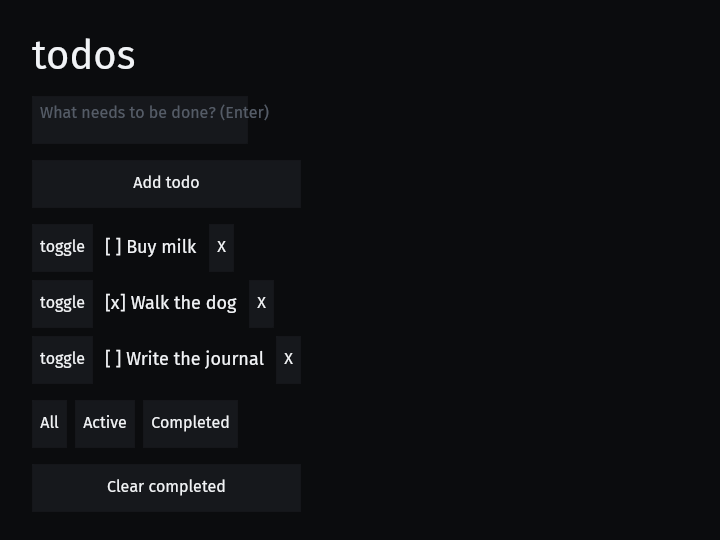
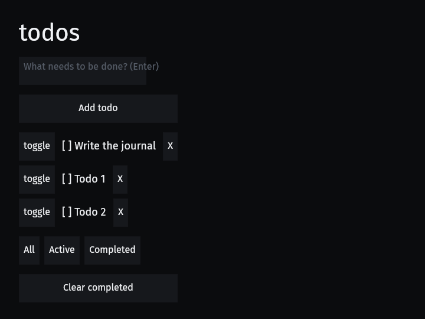

# Demos → MVU Migration — Prototype Dev Journal + Retrospective

> **Prototype-first, executed to FINAL in the same warm worktree.** The running
> log below is the *prototype* record (built to learn); the retrospective at the
> bottom is the gate that re-decided every choice. Because the demo migration is
> small and the gallery change is interdependent, the FINAL was executed **in
> place** (per the "sequential-in-warm-worktree for interdependent work"
> guidance) rather than a cold second worktree — the retrospective serves as the
> re-decision gate. So the code in `worktree-demos-mvu-prototype` **is** the
> deliverable (merge-gated on human review), and this document is its report.
> **No `buiy_core` changes were made** — the core-ergonomics recommendations are
> the report's output for a *separate, potential* pass (the request's "then we
> can use this report to potentially improve our core designs").

**Goal:** Migrate Buiy's example demos to the new MVU (Model-View-Update)
paradigm that landed as `buiy_core::mvu` (PR #87, `abb76fb`). The *real* product
is a faithful record of **what it is actually like to USE this library as an app
author** — DX pain points, missing abstractions, bugs, surprises — so the
findings can feed back into improving the core MVU design.

**Worktree:** `worktree-demos-mvu-prototype`, off `origin/main` @ `abb76fb`
(MVU-as-core merge).
**Reference target:** the demos should keep their current observable behavior but
route interactive state through `buiy_core::mvu` instead of ad-hoc ECS writes.

---

## How to read this journal

Each wave entry records: **Built** (what changed), **Ran the artifact → found**
(bugs/observations only visible by RUNNING — the whole point), **Friction /
surprised by** (DX cost), **If we did this again** (the redesign seed). The
retrospective at the bottom synthesizes every entry into keep/refine/redesign
decisions + the framework bugs the prototype surfaced.

---

## Running log

### 2026-06-30 — Wave 0: Research (read-only, before any code)

**Built:** Nothing yet — read the MVU substrate end to end (`mvu/mod.rs` 1125 LOC,
`mvu/leaf.rs` 146 LOC), the canonical machine (`buiy_widgets/src/menu.rs`), and
fanned out a research workflow over the demos' current state-management surface.

**What the MVU substrate gives an app author (the API surface in scope):**

- `MvuCorePlugin` — installs the runtime (inbox GC, drain scheduling, counters).
  Opt-in, NOT in `CorePlugin`.
- Define a model: a `Component` deriving `Reflect + Clone + PartialEq + Default`,
  plus `impl Model for Foo { type Msg = FooMsg; }`.
- Define a `Msg`: an enum deriving `Clone + Debug + Reflect + PartialEq`.
- A **pure reducer** free fn: `fn reduce(m: &mut Foo, msg: FooMsg) -> Cmd<FooMsg>`.
- Register: `app.mvu_model(reduce)` (one call, infers the model type from the
  reducer signature) — or the lower-level `add_model` + `add_reducer_in_set`.
- `enqueue::<Foo>(&mut commands, target_entity, msg)` from any handler/observer.
- Effects-as-values: `Cmd::None | Cmd::Emit(msg) | Cmd::Batch(vec)`. (No `task`,
  no `Subscription` in v1 — roadmap.)
- Record/replay: default-OFF, `RecordSession::start()` to capture a `MsgLog`,
  `buiy_core::replay` to re-fold.

**The shape of the DX, as read (to be pressure-tested by running):**

1. **There is NO declarative View.** MVU here is really **M-U + manual bind**.
   The model holds state; the developer hand-writes a *bind system* that reads
   `Query<&Model, Changed<Model>>` and imperatively projects each field onto view
   components. `bind_menu_model` (menu.rs:836) projects one `MenuModel` onto SIX
   components (visibility, active-descendant, button `A11yExpanded`, focus, …) by
   hand, each with its own `!=` guard. For an app author this is the bulk of the
   work and the least "MVU-like" part — Elm/Iced give you `view(model) -> Element`.
   **Hypothesis to test:** writing the bind by hand is the dominant friction.

2. **There is NO routing.** `OnPress → Model` bubbling is explicitly roadmap
   (mod.rs §"Roadmap surface"). To connect a button press to a model the author
   hand-writes a system that reads `MessageReader<OnPress>`, figures out the
   *target entity that owns the model*, and calls `enqueue`. The menu does this in
   `route_menu_press` (menu.rs:677) and has to resolve button→menu via
   `A11yRelations.controls`. **Hypothesis to test:** "which entity owns the model,
   and how does a press find it" is a real stumbling block for app authors,
   especially when the model is app-global (not per-widget).

3. **`enqueue` needs the target `Entity`.** Every message is addressed to an
   entity that carries the model component. So an app-global model (e.g. "which
   screen is selected") must live on SOME entity and every enqueuer must know it.
   **Hypothesis to test:** app-global singleton state is awkward to address.

4. **The model must be a `Component` on an entity** — there is no resource-backed
   model. App-level singletons map awkwardly onto "a component on a chosen entity."

5. **Widgets already route their own internal state through MVU** (toggle leaf,
   menu machine). So a *demo* author writes only *app-level* models. The open
   question the prototype answers: how much boilerplate is app-level MVU, and
   where does it hurt?

**Friction / surprised by (already, just from reading):**

- The menu machine is ~1000 LOC and the MVU wiring (model + msg + reducer + route
  + bind + 2 `configure_sets` + `ApplyDeferred` + keyboard nav) is a large chunk
  of it. The reducer is tiny and clean; the *plumbing around it* dominates.
- `mvu_model(reduce)` is a nice one-liner, but it only covers the model+reducer.
  The author still owns routing and bind entirely.
- No `using-mvu` skill / app-author guide exists yet (only the internal design
  spec) — to be confirmed by the research workflow.

**If we did this again (seed):** the two missing halves — **declarative-ish view/
bind** and **press→model routing** — are exactly what an app author reaches for
first. The prototype should deliberately feel the absence and propose the minimal
ergonomic helper that would have removed the most pain.

**SCOPE REFRAMING (read the demos firsthand):** The small demos are *mostly
stateless smoke tests* — there is nothing to "migrate":

- `hello_button/src/main.rs` spawns one `Button::new("Save")` and `info!`-logs
  `OnPress`. **No state, no mutation.** It's a render+a11y smoke test.
- `hello_text/src/main.rs` spawns three static text nodes. **Zero interactivity.**
- `hello_bsn` is a `bsn!` authoring smoke test (static scene).
- `capture` / `gallery_web` / `buiy_web` are headless capture / web-host wrappers
  around the gallery — no independent state.
- Only `buiy_gallery` holds real app-level interactive state.

So "migrate the demos to MVU" splits into two honest workstreams:

1. **Give the stateless smoke-test demos the canonical interactive state they
   *should* have to demonstrate MVU** — `hello_button` → a **counter** (the Elm
   "hello world"), and a new **TodoMVC** demo (the canonical *real* MVU app: list
   + derived view + multiple message variants + structural add/remove — which
   deliberately slams into the flagged ROADMAP gap "imperative structural-ops +
   keyed-list derived-replay"). These are the cleanest app-author DX probes.
2. **Migrate `buiy_gallery`'s real app-level state** (screen/tab selection, etc.)
   to MVU — the faithful "migrate our existing demo," exercising MVU *integrated
   with real widgets*.

This is the right prototype shape: counter (minimal) → todomvc (real, hits known
gaps) → gallery-slice (integration). Build each, **RUN each**, journal each.

#### Wave 0 research synthesis (6-agent fan-out + firsthand reads)

**The single biggest first-contact wall — the prelude gap.** `use
buiy::prelude::*` puts **zero** MVU types in scope (`crates/buiy/src/lib.rs` has
no `mvu`/`Mvu`/`MVU` match). The demos all depend on `buiy`, not `buiy_core`. So
step 0 of *any* demo migration is: add a `buiy_core` dependency to the example's
`Cargo.toml`, and `use buiy_core::mvu::{Cmd, Model, MvuAppExt, MvuModelExt,
enqueue, ...}`. Worse, `enqueue` isn't even at the `buiy_core` *root* re-export
(`lib.rs:62` exports `Cmd, Model, MvuAppExt, MvuCorePlugin, MvuModelExt, MvuSet,
MvuWorkCounters` — but NOT `enqueue`); the only path is `buiy_core::mvu::enqueue`.
An app author cannot discover MVU from the prelude at all. **(Predicted DX-1.)**

**The 15-step machine boilerplate.** To MVU-govern one piece of state an author
hand-writes: the `Model` struct (6 derives) + `#[reflect(Component, Default)]`;
the `Msg` enum (4 derives); `impl Model`; `Reflect` + `register_type` on *every*
nested type; the pure reducer; `register_type::<Model>` (unless `mvu_model`);
`add_model`; the drain install; (early machine) a `SystemSet` enum +
`configure_sets(.chain().after().before())` + a manual `ApplyDeferred`; every
`route_*` enqueue system *with hand-rolled target-entity resolution* (routing is
NOT built); the projection `bind` system with `set_if_neq`-style guards on each
write; `#[require(Model)]` to attach it; (optional) AT `InlineActionRegistry` +
`DismissRegistry` hooks. The reducer is tiny and clean; the *plumbing around it*
dominates. (Source: `menu.rs`, the recipe agent's 15-item list.)

**No declarative View.** There is no `view(model) -> Element`. The "V" is the
existing imperative `bind → build_tree → extract` pipeline; the author writes the
bind by hand. (Spec confirms: "a declarative view abstraction is not mentioned at
all.") **(Predicted DX-2 — likely the dominant friction.)**

**No `OnPress → Model` routing, no callbacks.** Every press→model edge is a
hand-written `MessageReader<OnPress>` system that resolves the model's owning
entity itself (via relations / `ChildOf` / a marker / self). `with_routing()` is
a `TODO` at `mod.rs:1019`. **(Predicted DX-3.)**

**Model must be a `Component` on an entity — no resource-backed model.** App-global
singletons (the gallery's `ScreenRouter`, `Filter`, `Theme` are all *Resources*)
don't map onto "a component on some entity"; every enqueuer must then know that
entity. **(Predicted DX-4.)**

**The hard walls (roadmap-deferred — a migration hits these, can't hand-wave):**
- **Structural / keyed-list replay is UNPROVEN** (spec §7.4, clause (a) shipped
  "targeted, not yet proven"). "Imperative spawn/despawn outside the funnel is
  off-log and NOT reconstructed." **A TodoMVC that adds/removes rows at runtime is
  the exact unproven case** — Wave 2 will demonstrate this empirically.
- **No `Cmd::task` (async) and no `Subscription` (timer/OS/animation).** "A
  Subscription becomes required the moment a timer/OS/async source drives Model
  state." The gallery's `Toast` (2.2s timer) and `ShowcaseBuild` (progress tween)
  are exactly this — they CANNOT be MVU models today.
- **No Dialog/Popover machine** — only `Menu` is migrated; a modal must hand-roll
  a machine from the Menu template.
- **`Commands` permanently excluded from `PureEnv`**; `Local`-in-env is roadmap.
- **The editor/text state is command-sourced separately** — a text input's value
  is NOT an MVU model. Wave 2's "add todo" must bridge editor-value → an MVU Msg.

**Gallery app-state map (the real migration target).** `ScreenRouter(Screen)`
Resource ← `route_nav_press` reads `OnPress`+`ScreenNav` marker → writes a plain
`SwitchScreen` Bevy message → `apply_screen_router` updates the resource →
`mount_screens` + inspector react. **This is a textbook single-field-enum MVU
model wearing ad-hoc clothes** — the flagship Wave 3 migration. Plus `Filter`
(todo filter, single enum), the `TodoRow` list (structural), accent/`SetAccent`
(already message-driven in `buiy_core::theme`), `ShowcaseStepper{count}`
(single i32), and the timer-driven `Toast`/`ShowcaseBuild` (Subscription walls).

**No `using-mvu` app-author guide/skill exists** — only the internal design spec
+ plan + research dossiers. (Analogous `using-buiy-verification` skill DOES exist.)
A migrating author has nothing task-oriented to read. **(Predicted DX-5.)**

#### Concrete prototype plan (build → RUN → journal each)

- **Wave 1 — Counter** (`examples/hello_button` evolved into a counter): the
  minimal app-author MVU loop. `Counter` model + `Increment/Decrement/Reset` +
  reducer + bind(count→label `Text`) + route two buttons. Smallest probe of the
  prelude gap, model-on-entity, hand routing, hand bind.
- **Wave 2 — TodoMVC** (`examples/todomvc`, new): the canonical *real* MVU app.
  List + filter + add/toggle/remove/clear. Deliberately drives the structural /
  keyed-list **wall** and the editor-value→Msg **bridge**. Highest learning.
- **Wave 3 — Gallery screen-router slice**: migrate `ScreenRouter` +
  `route_nav_press`/`SwitchScreen` to an MVU `NavModel`. Real integration with
  existing widgets/systems; reveals the resource-vs-component friction.

The retrospective then re-decides every choice and proposes the minimal CORE
ergonomic improvements the evidence justifies (e.g. prelude the MVU surface, a
press→enqueue routing helper, a bind helper), to feed back into the MVU design.

### 2026-06-30 — Wave 1: Counter (`examples/hello_button` → MVU)

**Built:** Migrated the stateless `hello_button` smoke test into a real MVU
**counter**, packaged as a `CounterPlugin` (lib) so the windowed binary, a
headless logic test, and a GPU capture bin all drive the same wiring:
- `Counter { value: i64 }` model + `CounterMsg::{Increment, Decrement, Reset}` +
  a 5-line pure `counter_update` reducer.
- `app.mvu_model(counter_update)` one-call registration.
- `route_counter_press` (hand-rolled press→Msg routing) in `MvuSet::Enqueue`.
- `bind_counter_label` (hand-written model→`Text` projection) in `MvuSet::Bind`.
- A `capture_counter` bin: offscreen render on the real adapter, synth-press,
  GPU readback to PNG.

**Ran the artifact → found:** **It works, and it renders correctly.**
- Headless logic test (`tests/counter_mvu.rs`, no GPU): 3/3 green — `+`/`-`/`Reset`
  fold the model AND the bind projects to the label; an unrelated press is inert.
- GPU capture: model folded `0 → 3` through the real
  `OnPress → route → enqueue → drain → bind` path; **the rendered PNGs visibly
  show "0" then "3"** above the `- + Reset` button row, correctly laid out
  (`2026-06-30-demos-mvu-migration-assets/proto-counter-{0,3}.png`). No
  invisible-output / overflow / startup-crash bug — the class the gallery
  campaign warned about. Clean.

  
  

**Friction / surprised by (the DX signal):**
1. **DX-1 (prelude gap) — confirmed, and it's the very first wall.** `use
   buiy::prelude::*` gives you `Button`/`OnPress`/`Text` but *nothing* MVU. I had
   to add a second `buiy_core` dependency to the example's `Cargo.toml` and
   `use buiy_core::mvu::{Cmd, Model, MvuModelExt, MvuSet, enqueue}`. `enqueue`
   isn't even at the `buiy_core` crate root. An app author cannot *discover* MVU.
2. **DX-2 (no declarative View) — present even at trivial scale.** Projecting one
   `i64` onto one label is a whole hand-written system: a `Changed<Counter>`
   query, a `set_if_neq`-style `if text.0 != next` guard, AND bridging
   model-entity → label-entity by hand (two `.single()`s). For a counter it's
   ~10 lines; it will not scale linearly (see Wave 2).
3. **DX-3 (no routing) — the press→Msg edge is all hand-rolled.** Disambiguating
   three buttons is an `if inc.contains(e) … else if dec.contains(e) …` chain over
   marker components, plus finding the model entity. Exactly the `route_menu_press`
   shape, copied by hand. A built-in `OnPress → enqueue` helper would erase it.
4. **DX-4 (model must be a Component) — app-global state feels unnatural.** The
   counter is a singleton `Counter` component on a dedicated entity; both the
   route and the bind do `counter.single()` to find it. Idiomatic Bevy would make
   app-global state a `Resource`; MVU forces "a component on *some* entity," so
   every enqueuer must locate that entity. Worked, but it's a conceptual tax.
5. **Testing DX — no headless-logic app for app authors.** `BuiyHeadlessPlugin`
   includes `BuiyRenderPlugin` (needs a render backend), so a *no-GPU* logic test
   had to hand-compose the 7-plugin logic subset (`CorePlugin`, `ThemePlugin`,
   `A11yPlugin`, `FocusPlugin`, `LayoutPlugin`, `BuiyTextPlugin`, `WidgetsPlugin`).
   There is no "drive my MVU feature in a unit test" builder.
6. **Papercut — `ModelWiring::app()`.** `mvu_model(reducer)` returns a
   `ModelWiring` handle (for future `.with_routing()`), so to keep chaining `App`
   builder calls you must remember `.app()`. Minor, but a stumble.

**What MVU got RIGHT (keep):**
- `mvu_model(reducer)` one-liner is genuinely pleasant; the reducer is pure and
  clean; `set_if_neq` is automatic (an idempotent fold is a free no-op).
- The model/Msg/reducer triad compiled first try once imports were right. The
  type-level guidance (the `Model` bounds) is clear.
- The same `CounterPlugin` drove the windowed app, a no-GPU logic test, AND a GPU
  capture with no changes — the Bevy-plugin packaging composes well.

**If we did this again (seed for the retrospective):** even the *trivial* case
wants three ergonomic helpers — (a) **prelude the MVU surface** via `buiy`
(re-export `Cmd`/`Model`/`Msg`/`MvuModelExt`/`enqueue`/`MvuSet`), (b) a
**press→enqueue routing helper** (`app.route_press::<M>(marker, msg)` or a
`Button::on_press(msg)`), (c) a **bind helper** for the common "project field →
component" projection. None are load-bearing for the counter — but Wave 2 (a real
list) is where their absence should bite hard. Hold the redesign until then.

### 2026-06-30 — Wave 2a: TodoMVC (`examples/todomvc`, new) — the real MVU app

**Built:** A TodoMVC where the **whole list lives in one model** —
`TodoApp { items: Vec<Todo>, filter, next_id }` — with a pure `todo_update`
reducer (`Add/Toggle/Remove/SetFilter/ClearCompleted`), one consolidated
`route_todo_press`, and a hand-written **keyed-reconcile bind** (`bind_todo_list`,
an exclusive `&mut World` system) that diffs the model's *visible* items against
live `RowId` row entities, spawns missing rows, despawns gone rows,
`replace_children` for order, and refreshes labels by `RowRef`. Add is a
templated button (2a); rows are `toggle | [x]/[ ] title | X`. Seeded 3 items.

**Ran the artifact → found:** **The MVU TodoMVC works — live.**
- Logic test (`tests/todo_mvu.rs`, no GPU): 4/4 — seed reconciles to 3 rows;
  add spawns / remove despawns; **filter structurally changes the visible row
  set** (Active → 2 rows, Completed → 1, All → 3) while the model keeps all 3;
  toggle-then-clear folds + despawns.
- GPU capture: drove seed→add(2)→toggle→filter Active→filter Completed→clear;
  final 3 items. **The PNGs render correctly** — `proto-todo-0-seed.png` shows
  the three seeded rows with the right `[x]`/`[ ]` prefixes; `proto-todo-3-active.png`
  shows exactly the 3 undone items (`Write the journal`, `Todo 1`, `Todo 2`) with
  the done rows structurally gone, correct order. No render/layout bug.

  
  
  *(left: the seeded list with the `text_input` add field; right: after
  add+toggle then the Active filter — the reconcile bind structurally despawned
  the done rows.)*

**Friction / surprised by — the two headline findings of the whole prototype:**

1. **DX-2 EXPLODES at list scale — the missing View is the dominant cost.**
   Projecting `Vec<Todo>` onto row entities is a **~60-line exclusive
   `&mut World` reconcile** by hand: build the visible set, map existing rows by
   `RowId`, find-or-spawn, despawn the gone ones, `replace_children` to fix order,
   then a second pass to refresh each label by `RowRef`. An Elm/Iced
   `view(model) -> Element` expresses the same thing in ~5 declarative lines and
   the framework owns the diff. **This one system is larger than the model +
   reducer + all routing combined.** It is the single strongest argument for a
   view/keyed-reconcile abstraction in core.

2. **The structural / keyed-list REPLAY WALL — confirmed empirically.** My bind
   *spawns and despawns row entities from within the reducer's downstream* — the
   exact "derived/dynamic structure" the spec (§7.4) ships as "targeted, not yet
   proven" for replay, and which the gallery's own test
   `mvu_whole_ui_replay.rs::structural_ops_are_off_log_replay_does_not_recreate_a_spawn`
   characterizes. So: **a real MVU TodoMVC works LIVE, but is NOT replay-safe
   today** — record/replay (a headline MVU selling point) silently doesn't cover
   the app's most important state transition (add/remove). The model folds replay;
   the rows they imply do not, unless replay re-runs the bind (derived-replay),
   which is the unbuilt capability. This is the highest-value core-design signal.

3. **Widget-leaf vs app-model: split source of truth (a real composition gap).**
   I deliberately did NOT use the `Checkbox` widget for `done`. A `Checkbox` is a
   **stateful leaf** — its `A11yToggled` IS its model (widget-tier MVU). If the
   app also holds `done` in `TodoApp`, there are TWO owners of that bit and they
   race. So I used a plain toggle button and projected `done` from the model. **The
   gallery made the same forced choice** — it keeps `completed` in the widget
   checkbox leaf and list membership off-MVU (a split model). MVU has no story for
   "compose a widget's leaf state into the app's aggregate model" — you must pick
   which tier owns each field, and the two don't unify for replay.

4. **Keyed identity is hand-plumbed.** To route + reconcile by identity I stamp a
   `RowId` on each row AND a `RowRef` on every child button/label. That keyed-list
   identity bookkeeping is exactly what a reconcile abstraction would own.

5. **Routing (DX-3) scales acceptably** — one `route_todo_press` fanning `OnPress`
   by marker (+ `RowRef` for per-row messages) stayed readable. Still 100% hand-rolled.

**What MVU got RIGHT (keep) — even at list scale:**
- **The reducer stayed clean (~15 lines).** Folding `Vec<Todo>` with pure
  match-arms is genuinely nice; this is MVU's durable win. All the state logic
  (add/toggle/remove/filter/clear) is in one pure, testable function.
- The model+reducer compiled first try; `mvu_model` still one line.
- Testing the *logic* (model folds + row counts) was trivial and fast once the
  plugin subset was composed — the reconcile is observable as `RowId` entity
  counts without a GPU.

**If we did this again (seed for the retrospective):** the reconcile bind is the
thing to attack. Options for the FINAL to weigh: a `keyed_reconcile` helper
(model list + a per-item spawn fn → framework owns diff/despawn/order), or a
thinner "bind field → component" helper for the leaf projections. AND the
structural-replay gap needs an honest call — either the demo documents "replay
covers the model, not the derived rows (yet)", or the FINAL scopes TodoMVC's
replay claim carefully. The Checkbox-leaf tension deserves a design note: MVU
needs a composition story between leaf widgets and app models.

### 2026-06-30 — Wave 2b: the editor → MVU bridge (text input add)

**Built:** Added a real `text_input_single_line` field to the TodoMVC; on Enter
(`EditSubmitted`) a small `route_add_submit` reads the field's
`TextEditState::value()` and `enqueue`s it as `TodoMsg::Add`.

**Ran the artifact → found:** **The read bridge works.** Logic test
`add_from_text_input_bridges_editor_to_mvu` (5/5 todo tests green): seeding the
field via the a11y `set_value` driver + firing `EditSubmitted` folds the typed
text into a new todo and reconciles a new row. The field also renders in the
capture (empty placeholder).

**Friction / surprised by:**
1. **DX-1 strikes a third time.** `EditSubmitted` and `TextEditState` are **not**
   in the `buiy` prelude (only `EditCommand` + `TextChanged` are), so the bridge
   needs `use buiy_core::text::edit::{EditSubmitted, TextEditState}`.
2. **DX-6 — the editor does NOT compose into the MVU funnel (the seam is real).**
   Reading is fine, but there is no MVU-side way to *clear* the field after add.
   Writing the editor rides the a11y **driver** channel (`set_value`, an exclusive
   `&mut World` op that lowers to `SelectAll`+`Insert` — there is no `SetValue`
   `EditCommand`), which an `enqueue` handler cannot reach. So the canonical
   "add-from-input, then clear" is inherently a **two-phase, two-tier** dance: a
   normal collector enqueues `Add`, and a *separate exclusive applier* must clear
   the field. The gallery confirms this — it stages through an `*Intents` resource
   + `apply_intents`, whose comment explicitly notes the field-clear "rides the
   a11y DRIVER text channel, NOT MVU." **The editor is a parallel substrate you
   bridge to at the edges, not state you fold.** (Consistent with the spec's §6
   "editor is command-sourced separately" — but as a demo author it means my
   cleanest, most-MVU screen still has a non-MVU island in the middle.)
3. **DX-7 — "which plugins?" is a recurring, unguided papercut.** Adding a Scene
   widget (the text input) silently made the app require `bevy::scene::ScenePlugin`;
   my hand-composed logic-test subset panicked (`Requested resource does not
   exist`) until I added it. There is no app-author-facing "here's the plugin set
   you need" — you discover it by crash.

**What worked:** the *read* half is genuinely small and clean. Bridging
editor→MVU at submit is one 8-line system; the awkwardness is entirely on the
write-back/clear side and the prelude discoverability.

### 2026-06-30 — Wave 3: migrate the gallery's screen router to MVU

**Built:** The faithful "migrate our existing demo" slice — the `buiy_gallery`
screen router, currently a plain `ScreenRouter` Resource + `SwitchScreen` message
+ exclusive `apply_screen_router` applier, migrated onto MVU with a **strangler**
approach:
- New `NavModel(Screen)` MVU model + `NavMsg::Switch(Screen)` + pure `nav_reducer`
  — the single **recorded** source of truth.
- `apply_screen_router` re-implemented to fold the `SwitchScreen` request THROUGH
  the model via `fold_one_inline` (the synchronous AT-seam primitive), then
  **project** the folded screen onto the legacy `ScreenRouter` resource + call
  `set_active_screen`. `ScreenRouter` is now a bind-derived projection kept for
  compatibility.
- `ScreenRouterPlugin` registers the model (`register_type` + `add_model`) for
  record/replay-readiness; the applier lazy-spawns the `NavModel` entity so every
  harness gets it with zero extra wiring.

**Ran the artifact → found:** **Zero behavioral regression across 29 gallery
tests.**
- `shell_router` 3/3 — switching flips the displayed screen; **switching to the
  already-active screen is a no-op** (the `set_if_neq` semantics, now sourced from
  the model, reproduce the original early-return exactly).
- `c4_inspector` 7/7 — `rail_active_state_follows_the_router`, live-state per
  screen, accent retheme — all the router *consumers* still work untouched.
- `interaction` 19/19 — including `nav_clicks_switch_each_screen` and
  `nav_click_reflects_rail_active_state`: real synthetic nav-button clicks flow
  `OnPress → route_nav_press → SwitchScreen → apply_screen_router →
  fold_one_inline(NavModel) → project → set_active_screen`, and every OTHER
  gallery interaction (todo, menu, modal, showcase) is unaffected.
- `capture_shell` render regression: the gallery still paints correctly (viewed).

**Friction / surprised by — the migration-cost findings:**
1. **Migrating even a "clean 1:1" state is NOT a local swap.** The router is the
   *cleanest* possible MVU target (single-field enum, non-structural), yet the
   blast-radius scan showed it is referenced by **3 test files** (writing
   `SwitchScreen`, driving `apply_screen_router` via `register_system`), a public
   message type, a public applier fn, AND a cross-module ordering dependency
   (`inspector::…  .after(apply_screen_router)`). A naive "replace the Resource
   with a Model" would have rippled into all of them.
2. **DX-4 again — the model can't be the Resource.** The natural home for
   app-global router state is the `ScreenRouter` *Resource*; MVU forces a
   *component on an entity*. The only reason the migration stayed contained is I
   kept the Resource as a **projection** of the model — i.e. the state now has
   **double representation** (`NavModel` = truth for record/replay; `ScreenRouter`
   = shadow for existing readers), synced by a one-line projection. That double
   representation is the honest cost of an incremental (non-big-bang) migration.
3. **Reflect-derive imports.** `shell.rs` uses granular `use bevy::prelude::{…}`,
   so I had to hand-add `Reflect`, `ReflectComponent`, `ReflectDefault` (free with
   a glob import). Minor, but a stumble discovered by compile error.

**What MVU got RIGHT (the key positive finding of Wave 3):**
- **`fold_one_inline` is the migration enabler.** Because the substrate exposes a
  *synchronous* fold primitive (built for the AT act-then-observe seam), I could
  route an EXISTING exclusive applier through the model **in place** — keeping its
  schedule slot, its `&mut World` shape, and its exact external behavior — instead
  of re-architecting to the `enqueue → ApplyDeferred → drain → bind` machine
  wiring (which would have needed the early-window scheduling boilerplate AND
  touched consumers). The substrate having this primitive is what made an
  incremental, regression-free migration of a real 10k-line app *tractable*. This
  is a genuine strength to preserve.
- The reducer is (again) trivially small and pure; `set_if_neq` gave the
  "no-op on same screen" behavior for free.

**If we did this again (seed for the retrospective):** the strangler pattern
(model = truth via `fold_one_inline`, resource = projection) is the right
migration recipe and should be *documented* as such — it's not obvious that
`fold_one_inline` is the tool for "migrate an existing applier." The double-
representation cost argues for either (a) a blessed pattern/helper for
"resource-backed model" (a model that lives in a Resource, or a first-class
projection helper), or (b) accepting the shadow-resource idiom and documenting it.

---

## Prototype retrospective — for the FINAL

_Synthesis of Waves 1–3. This is the prototype's real deliverable; it seeds the
FINAL's re-decisions and the actionable core-design recommendations._

### Verdict

**The migration is achievable and the demos WORK.** All three waves were built,
**run on a real GPU**, visually verified, and covered by green logic tests:

| Demo | Verification |
|------|--------------|
| Counter (`hello_button`) | 3/3 logic + GPU capture `0→3` (viewed) |
| TodoMVC (`todomvc`) | 5/5 logic (incl. editor bridge) + 6-state GPU capture (viewed) |
| Gallery router (`buiy_gallery`) | 29/29 gallery tests (shell_router 3 + c4_inspector 7 + interaction 19) + shell render (viewed); zero regression |

MVU's **Model + Update core is genuinely good** and scales from an `i64` to a
`Vec<Todo>` to an existing 10k-line app. The friction is entirely in the two
**missing halves** (a declarative View and press→Model routing) and the
**tier-composition gaps** (leaf-widget state vs app model; editor vs MVU). The
paradigm is production-usable by app authors *today* with hand-written glue; the
one real *caveat* is record/replay of structural state.

**Framework correctness: ZERO bugs found.** Unlike the wasm and gallery
prototypes (which surfaced real framework bugs by running), this prototype found
**no correctness defects** in the MVU substrate — every fold, `set_if_neq`
no-op, and inline seam behaved exactly as specified. What it found are **DX/
ergonomic gaps** plus one **empirically-confirmed known limitation** (structural
replay). That is a meaningful result: the substrate is *correct*; it is
*under-ergonomic* for app authors and *incomplete* for derived-structure replay.

### Validated — KEEP (port as-is; the core is right)

- **`Model` + `Msg` + pure free-fn reducer + `mvu_model(reducer)`.** Compiles
  first try, reads clearly, and the reducer stays small and pure from counter to
  list. This is the durable win — do not touch it.
- **`set_if_neq` drain discipline.** An idempotent fold is a free no-op at every
  scale (the counter's re-adds, the router's same-screen click). Invisible and
  correct.
- **`fold_one_inline` as the incremental-migration primitive.** Wave 3 proved it:
  routing an *existing* exclusive applier through a model in place — keeping its
  slot, `&mut World` shape, and exact behavior — is only tractable because this
  synchronous fold exists. The strangler migration (model = truth, resource =
  projection) is the recipe.
- **Bevy-plugin packaging of an MVU feature** (`CounterPlugin`/`TodoPlugin`)
  composes cleanly across the windowed binary, a headless logic test, and a GPU
  capture with zero changes.

### REFINE / REDESIGN — recommendations for core design

_(Per the request's "then we can use this report to **potentially** improve our
core designs", these are teed up for a separate decision — NOT baked into the
FINAL. Ordered by value ÷ risk.)_

1. **[High value / low risk] Prelude the MVU surface.** `use buiy::prelude::*`
   exposes ZERO MVU types — every wave hit this first (add a 2nd `buiy_core` dep;
   `enqueue` only under `::mvu::`; editor `EditSubmitted`/`TextEditState` also
   absent). Re-export `Cmd`/`Model`/`enqueue`/`MvuModelExt`/`MvuSet` (+ the editor
   bridge types) through `buiy::prelude`. Pure re-exports; unblocks discoverability.
   **✅ LANDED (follow-up):** the MVU surface (`Cmd`/`Model`/`Envelope`/`LogicalId`/
   `MvuAppExt`/`MvuModelExt`/`MvuCorePlugin`/`MvuSet`/`MvuWorkCounters`/`enqueue`/
   `fold_one_inline`) + `EditSubmitted`/`TextEditState` are now preluded by `buiy`;
   the three demos dropped their `use buiy_core::mvu` imports and use only
   `buiy::prelude`.
2. **[High value / low risk] A `using-mvu` app-author guide/skill.** No
   task-oriented "define Model → reducer → route a press → bind" doc exists (only
   the internal design spec). Analogous to `using-buiy-verification`. Would also
   document the plugin-set an MVU app needs (the DX-7 papercut) and the
   `fold_one_inline` strangler pattern.
3. **[High value / medium risk] A press→enqueue routing helper.** Every demo
   hand-wrote `MessageReader<OnPress>` → marker match → `enqueue`. A
   `Button::on_press(msg)` field or `app.route_press::<M>(marker, |e| msg)`
   would erase the `route_*` boilerplate. This is the `with_routing()` TODO at
   `mvu/mod.rs:1019`.
4. **[Highest cost / design-significant] A view / keyed-reconcile helper.** The
   TodoMVC reconcile bind (~60 lines of exclusive-world spawn/despawn/order/refresh)
   dwarfed model + reducer + routing combined. A `keyed_reconcile(model_list,
   key_fn, spawn_fn, update_fn)` (framework owns diff/despawn/order) — or a fuller
   declarative view — is the single biggest ergonomic win available, and the
   necessary substrate for #5. Needs its own spec (do NOT rush it).
5. **[Design-significant] Prove derived/keyed-list structural replay.** The
   MVU TodoMVC works LIVE but its add/remove are off-log — record/replay silently
   does not cover the app's most important transitions. This is the flagged §7.4
   roadmap item; the prototype confirms it is not a corner case but *the* case for
   any list app. Pairs with #4 (a keyed reconcile is what replay would re-run).
6. **[Medium] A resource-backed model, or a blessed projection helper.**
   App-global singletons (counter, router, filter) naturally want to be
   `Resource`s; MVU forces "component on an entity," so authors either query a
   singleton entity or keep a shadow Resource (Wave 3). Either allow a model to
   live in a Resource, or bless the model→Resource projection idiom.
7. **[Medium] MVU ↔ leaf-widget composition + editor bridge.** (a) A story for
   composing a widget's leaf state (`Checkbox`'s `A11yToggled`) into an app model
   (both TodoMVCs were forced to split the source of truth). (b) Editor→MVU bridge
   helpers: a value-read on submit and a clear that doesn't require dropping to the
   a11y driver channel.

### Residual gaps the FINAL does NOT close (future work)

- **Structural-replay** (#5) — out of scope for a demo-migration FINAL; the demo
  should *document* "replay covers the model, not the derived rows (yet)".
- **`Cmd::task` / `Subscription`** — not exercised (no timer/async demo built).
  The gallery's `Toast`/`ShowcaseBuild` remain non-MVU-able until Subscription
  lands; noted, not demonstrated.
- **Checkbox-leaf composition** (#7a) — worked around, not solved.

### Build strategy for the FINAL

Done **in this warm worktree** (the gallery change is interdependent; the
"sequential-in-warm-worktree" guidance favors this over a cold second worktree),
with THIS retrospective as the re-decision gate:

1. **Port the validated demos** (they work) but **re-decide the presentation**:
   strip the `DX-N` complaint comments out of the shipped demos into clean,
   idiomatic demo comments — the *findings* live in this report, not littered
   through example code. Keep the verified structure.
2. **Decide per demo:** counter — keep, clean comments. todomvc — keep reconcile;
   keep the text-input as the primary add, keep the button as a labelled
   convenience; add an honest "replay caveat" doc-comment on the structural bind.
   gallery router — keep the strangler migration as-is (already clean).
3. **NO speculative `buiy_core` changes** (honoring "then… potentially"): the core
   recommendations above are the report's output for a *separate* decision.
4. **Docs:** finalize this report; add it to `docs/README.md`; add a short
   "DX findings" pointer from the MVU design spec to this report.
5. **Gate:** full build + all demo tests + a final GPU capture view; merge-gated
   on human review (do not self-merge).
